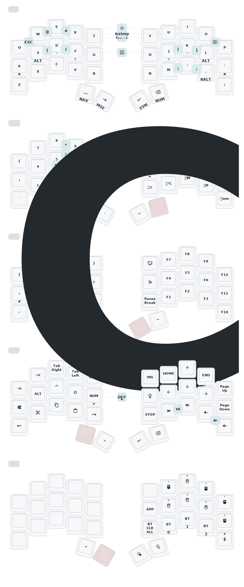
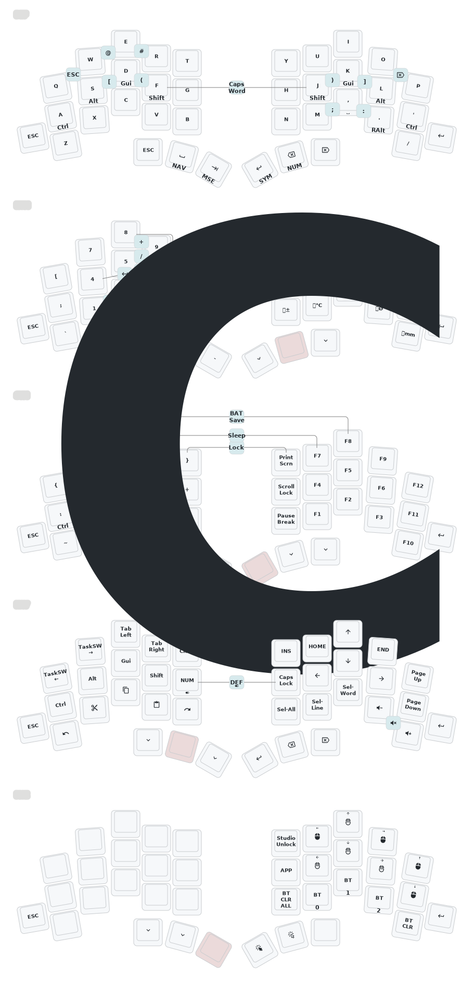

# zmk-config

This is my personal [zmk-config](https://zmk.dev/) for my Split keyboards.  
Sweep Bluethooth(Nice!Nano) or Display Dongle(Xiao_ble), Studio available.  
Totem Dongle(Xiao_ble), Studio available.

## Modules

Additional features are provided by the following [modules](https://zmk.dev/docs/features/modules):  

- [**zmk-dongle-display**](https://github.com/englmaxi/zmk-dongle-display) to show the peripheral battery percentage (and more!) on the display of my dongle.  
- [**zmk-rgbled-widgets**](https://github.com/caksoylar/zmk-rgbled-widget) to show the connection and battery status with the built-in LEDs of the Xiao BLE controller. Based on this, the module was adapted in [led_indicator](boards/shields/led_indicator) to be used with the single LED of the nice!nano.

## Boards and Keymaps

  
<a href="https://github.com/davidphilipbarr/Sweep">Sweep</a> (34 keys)

  

  _(keymap image created with [caksoylar/keymap-drawer](https://github.com/caksoylar/keymap-drawer))_

  
<a href="https://github.com/GEIGEIGEIST/zmk-config-totem">Totem</a> (38 keys)

  

  _(keymap image created with [caksoylar/keymap-drawer](https://github.com/caksoylar/keymap-drawer))_

 

## Inspirations

- [caksoylar/zmk-config](https://github.com/caksoylar/zmk-config)
- [minusfive/zmk-config](https://github.com/minusfive/zmk-config)
- [stevep99/seniply](https://stevep99.github.io/seniply/)
- [urob/zmk-config](https://github.com/urob/zmk-config)
- [englmaxi/zmk-config](https://github.com/englmaxi/zmk-config)
- [eigatech/zmk-config](https://github.com/eigatech/zmk-config)
- [manna-harbour/miryoku_zmk](https://github.com/manna-harbour/miryoku_zmk)
